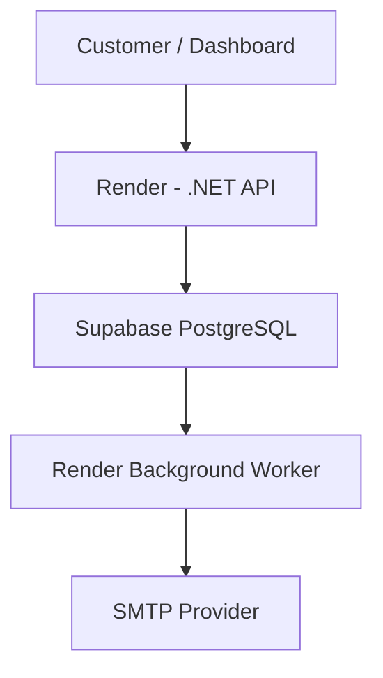

# TriSend Architecture

## Message flow

1. API authenticates the tenant and validates the request.
2. API persists the message with status `queued`.
3. The worker polls PostgreSQL and claims one queued message using PostgreSQL row locking with `FOR UPDATE SKIP LOCKED`.
4. The worker sends email through SMTP.
5. The worker records `sent` or `failed` status.
6. The API exposes message status to the caller.

The queue is database-backed for the current Render deployment. This removes the Azure Service Bus dependency from the MVP deployment.

Provider credentials and application secrets must be supplied as Render environment variables. Never commit credentials.
