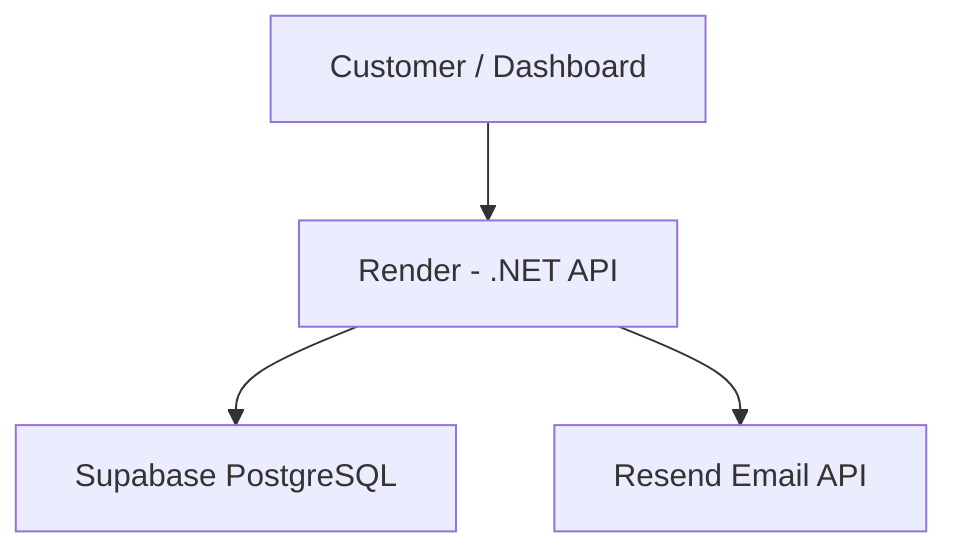

# TriSend Architecture

## Message flow

1. API authenticates the tenant and validates the request.
2. API stores the message with status `processing`.
3. API sends the email to Resend over HTTPS.
4. Resend returns the provider email ID.
5. API records `sent` or `failed` status in Supabase.
6. The API exposes the stored message status to the caller.

Resend idempotency keys are used to reduce duplicate sends when the same request is retried.

Provider credentials and application secrets must be supplied as Render environment variables. Never commit credentials.
